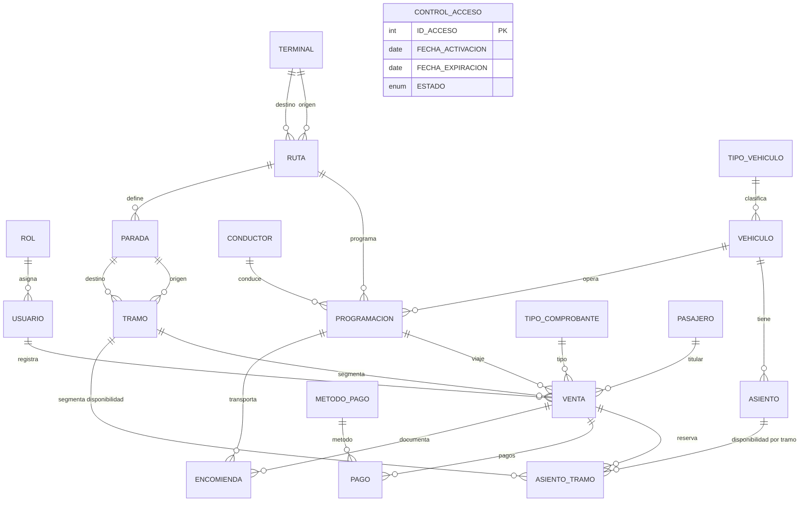

# Sistema de Venta de Pasajes - API REST

API REST en Go para operación de terminales, rutas, programación, ventas, pagos, encomiendas y control de acceso del sistema.

## Checklist de estado actual
- [x] Arquitectura por módulos (`internal/<modulo>`)
- [x] Router con Gorilla Mux
- [x] Persistencia con GORM + MySQL
- [x] Respuesta y errores estandarizados en `pkg`
- [x] Autenticación JWT y autorización por roles
- [x] Control de acceso operativo (`OPERATIVO`, `SOLO_LECTURA`, `BLOQUEADO`)

## Stack
- Go 1.25.x
- Gorilla Mux
- GORM
- MySQL 8+

## Estructura del proyecto (convención única)
```text
sistema_venta_pasajes/
├── cmd/
│   └── app/
│       └── main.go
├── configs/
│   ├── app.go
│   ├── config.go
│   ├── database.go
│   └── http/
│       ├── middleware/
│       └── routes/
├── internal/
│   ├── auth/
│   ├── control_acceso/
│   ├── terminal/
│   ├── empresa/
│   ├── conductor/
│   ├── ruta/
│   ├── parada/
│   ├── tramo/
│   ├── vehiculo/
│   ├── asiento/
│   ├── asiento_tramo/
│   ├── pasajero/
│   ├── usuario/
│   ├── programacion/
│   ├── venta/
│   ├── pago/
│   ├── encomienda/
│   └── liquidacion/
├── pkg/
├── .env.example
├── go.mod
└── README.md
```

## Variables de entorno
El backend carga variables en este orden:
1. `.env`
2. `.env.local` (opcional para sobrescribir en local)

### Ejemplo
```dotenv
APP_PORT=8080
APP_ENV=development
AUTH_DISABLED=false
JWT_SECRET=REEMPLAZAR_POR_UN_SECRETO_LARGO_Y_SEGURO

DB_HOST=127.0.0.1
DB_PORT=3306
DB_NAME=SISTEMA_PASAJES
DB_USER=root
DB_PASS=
DB_PARAMS=parseTime=true&loc=Local&charset=utf8mb4
DB_MAX_OPEN_CONNS=10
DB_MAX_IDLE_CONNS=5
DB_CONN_MAX_LIFETIME_MIN=30

HTTP_READ_TIMEOUT=10
HTTP_WRITE_TIMEOUT=10
```

## Ejecución local
```powershell
& "C:\Program Files\Go\bin\go.exe" run ./cmd/app
```

## Tests
```powershell
& "C:\Program Files\Go\bin\go.exe" test ./...
```

## Seguridad
- JWT HS256 (`JWT_SECRET`) para autenticación.
- Roles con middleware `RequireRole`.
- Rate limit en login y API general.
- `AUTH_DISABLED=true` solo para desarrollo local (nunca en producción).

## Control de acceso del sistema
La tabla `CONTROL_ACCESO` define estado operativo:
- `OPERATIVO`: lectura/escritura normal
- `SOLO_LECTURA`: solo `GET`
- `BLOQUEADO`: bloquea toda operación funcional

## Modelo de ruta, parada y tramo
- `TERMINAL`: se usa para definir solo terminal de origen y terminal de destino final de la `RUTA`.
- `PARADA`: representa puntos intermedios de una ruta con `nombre_parada` y `orden`.
- `TRAMO`: representa segmentos vendibles entre dos paradas (`id_parada_origen` y `id_parada_destino`).

## Disponibilidad de asientos por tramo
- La ocupación de asientos se controla por tramo (no de forma global por vehículo).
- `ASIENTO_TRAMO` registra el estado de cada asiento en cada tramo (`DISPONIBLE` u `OCUPADO`).
- Al crear una `VENTA`, el backend valida disponibilidad en el tramo y marca ocupación.
- Al eliminar/anular la `VENTA`, el backend libera el asiento en el tramo correspondiente.
- Esto permite reutilizar el mismo asiento en tramos distintos de una misma ruta.

## Convención de rutas
- Base API protegida: `/api/v1`
- Módulos principales usan rutas de colección y por ID según su `register.go`.
- Ejemplos de colección: `/api/v1/proveedor`, `/api/v1/empresa`, `/api/v1/vehiculos`, `/api/v1/venta`.
- Estado del sistema público: `/api/v1/control-acceso/status`.

Ejemplo de `PARADA` en API:
```json
{
  "id_ruta": 1,
  "nombre_parada": "Huanta",
  "orden": 2
}
```

Ejemplo de `TRAMO` en API:
```json
{
  "id_ruta": 1,
  "id_parada_origen": 10,
  "id_parada_destino": 12
}
```

## Diagrama de base de datos (modelo operativo)


## Notas de producción
- No versionar secretos reales.
- Usar variables de entorno del servidor/orquestador.
- Rotar `JWT_SECRET` antes de despliegue final.
- Mantener `AUTH_DISABLED=false` en producción.
